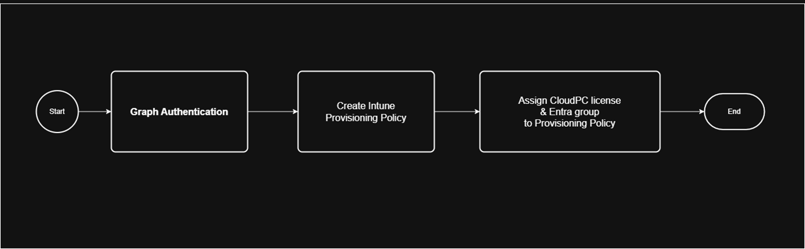
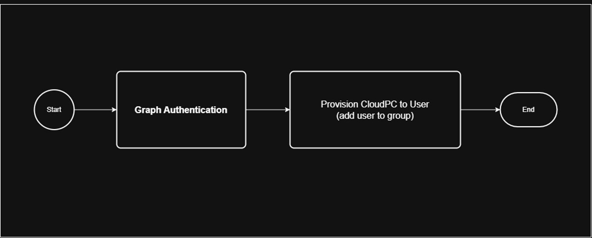

# Graph API Reference documentation #

This exercise will make you familiar with the Graph API Reference documentation, to gather all the information to:
- understand what Graph permissions need to be configured for your Service Principal
- how to authenticate against the Graph API
- re-use the access_token for additional Graph API calls

## Provisioning Windows 365 Cloud PC to a user ##

### Create an Intune provisioning policy and assign a group ###
The first processflow focuses on creating the Intune provisioning policy for a frontline Cloud PC and assigns a Entra group to this policy.   
   
<u>Exercise:</u> Based on the Graph API Reference documentation, translate the processflow to a workflow that contains each step, corresponding to a Graph API call, and the call details for each step:   

    

        Answer
    

    A visual of the workflow can be found here: <a href='https://github.com/cloud-devops-ninja/myWorkshops/blob/main/GraphAPI_StarterKit/Exercises/Exercise01/01_ANSWER_WF_W365_Create_ProvPol.png' target='_new'>01_ANSWER_WF_W365_Create_ProvPol.png</a>    
    The workflow for the Graph API call will consist of the following steps:
    <ul>
    <li><a href='https://learn.microsoft.com/en-us/graph/auth-v2-user?view=graph-rest-1.0&tabs=http#step-2-request-an-access-token' target='_blank'>Graph Authentication:</a></li>
    
Note: Keep in mind that this is a special Graph API call to authenticate and retrieve a bearer token for future calls.

    <b>HTTP Method:</b> POST 
    <b>URI:</b> https://graph.microsoft.com/v1.0/deviceManagement/virtualEndpoint/provisioningPolicies 
    <b>REQUEST BODY:</b> 
    <code>{
    "grant_type": "client_credentials",
    "client_id": "{{clientId}}",
    "client_secret": "{{clientSecret}}",
    "scope": "https://graph.microsoft.com/.default"
}</code> 
    <b>REQUEST HEADER:</b> 
    <code>{
    "Content-Type": "application/x-www-form-urlencoded"
}</code>
    <li><a href='https://learn.microsoft.com/en-us/graph/api/virtualendpoint-post-provisioningpolicies?view=graph-rest-1.0&tabs=http' target='_blank'>Create Intune Provisioning Policy:</a></li>
    <b>HTTP Method:</b> POST 
    <b>URI:</b> https://graph.microsoft.com/v1.0/deviceManagement/virtualEndpoint/provisioningPolicies 
    <b>REQUEST BODY:</b> 
    <code>{
    "@odata.type": "#microsoft.graph.cloudPcProvisioningPolicy",
    "description": "Windows 365 CloudPC Frontline Provisioning Policy",
    "displayName": "CPC-W365-Frontline-Provisioning-01",
    "domainJoinConfigurations": [
        {
            "domainJoinType": "azureADJoin",
            "regionName": "automatic",
            "onPremisesConnectionId": null,
            "regionGroup": "europeUnion"
        }
    ],
    "enableSingleSignOn": true,
    "imageDisplayName": "win11-23h2-ent-cpc-m365",
    "imageId": "{{cpc-gallery-image-id}}",
    "imageType": "gallery",
    "cloudPcNamingTemplate": "CPC-%USERNAME:5%-%RAND:5%",
    "windowsSetting": {
        "locale": "en-US"
    },
    "microsoftManagedDesktop": {
        "managedType": "notManaged",
        "profile": ""
    },
    "provisioningType": "shared"
}</code> 
    <b>REQUEST HEADER:</b> 
    <code>{
    "Authorization": "Bearer {{graphBearerToken}}",
    "Content-Type": "application/json"
}</code>
    <li><a href='https://learn.microsoft.com/en-us/graph/api/cloudpcprovisioningpolicy-assign?view=graph-rest-1.0&tabs=http' target='_blank'>Assign a group to the Provisioning Policy:</a></li>
    <b>HTTP Method:</b> POST 
    <b>URI:</b> https://graph.microsoft.com/v1.0/deviceManagement/virtualEndpoint/provisioningPolicies/{{cpc-provisioning-policy-id}}/assign 
    <b>REQUEST BODY:</b> 
    <code>{
  "assignments": [
    {
      "target": {
        "@odata.type": "microsoft.graph.cloudPcManagementGroupAssignmentTarget",
        "groupId": "{{cpc-group-id}}",
        "servicePlanId": "{{cpc-frontline-serviceplan-id}}"
      }
    }
  ]
}</code> 
    <b>REQUEST HEADER:</b> 
    <code>{
    "Authorization": "Bearer {{graphBearerToken}}",
    "Content-Type": "application/json"
}</code>
    <li><a href='https://learn.microsoft.com/en-us/graph/api/group-get?view=graph-rest-1.0&tabs=http' target='_blank'>Get Group ID from Entra:</a></li>
    <b>HTTP Method:</b> GET 
    <b>URI:</b> https://graph.microsoft.com/v1.0/groups?$filter=startswith(displayName, 'grp-sec-W365Users-01')&$top=1&$select=id, displayName,description 
    <b>REQUEST BODY:</b><code>no request body</code> 
    <b>REQUEST HEADER:</b> 
    <code>{
    "Authorization": "Bearer {{graphBearerToken}}",
    "Content-Type": "application/json"
}</code>
    <li><a href='https://learn.microsoft.com/en-us/graph/api/cloudpcgalleryimage-get?view=graph-rest-1.0&tabs=http' target='_blank'>Get Gallery Image ID:</a></li>
    <b>HTTP Method:</b> GET 
    <b>URI:</b> https://graph.microsoft.com/v1.0/deviceManagement/virtualEndpoint/galleryImages?$filter=startswith(skuName, 'win11-23h2-ent-cpc-m365')&$select=id, publisherName,offerName,skuName,displayName,sizeInGB,status 
    <b>REQUEST BODY:</b><code>no request body</code> 
    <b>REQUEST HEADER:</b> 
    <code>{
    "Authorization": "Bearer {{graphBearerToken}}",
    "Content-Type": "application/json"
}</code>
    <li><a href='https://learn.microsoft.com/en-us/graph/api/cloudpcgalleryimage-get?view=graph-rest-1.0&tabs=http' target='_blank'>Get Group ID from Entra:</a></li>
    <b>HTTP Method:</b> GET 
    <b>URI:</b> https://graph.microsoft.com/v1.0/deviceManagement/virtualEndpoint/galleryImages?$filter=startswith(skuName, 'win11-23h2-ent-cpc-m365')&$select=id, publisherName,offerName,skuName,displayName,sizeInGB,status 
    <b>REQUEST BODY:</b><code>no request body</code> 
    <b>REQUEST HEADER:</b> 
    <code>{
    "Authorization": "Bearer {{graphBearerToken}}",
    "Content-Type": "application/json"
}</code>
    </ul>

   
  
### Add a user to a (Cloud PC provisioning) group ###
The second processflow focuses on adding a user to the assigned group of an Intune provisioning policy to automatically provision a Cloud PC to the user.   
   
<u>Exercise:</u> Based on the Graph API Reference documentation, translate the processflow to a workflow that contains each step, corresponding to a Graph API call, and the call details for each step:   

    

        Answer
    

    A visual of the workflow can be found here: <a href='https://github.com/cloud-devops-ninja/myWorkshops/blob/main/GraphAPI_StarterKit/Exercises/Exercise01/02_ANSWER_WF_W365_AssignCloudPC_to_User.png' target='_new'>02_ANSWER_WF_W365_AssignCloudPC_to_User.png</a>    
    The workflow for the Graph API call will consist of the following steps:
    <ul>
    <li><a href='https://learn.microsoft.com/en-us/graph/auth-v2-user?view=graph-rest-1.0&tabs=http#step-2-request-an-access-token' target='_blank'>Graph Authentication:</a></li>
    
Note: Keep in mind that this is a special Graph API call to authenticate and retrieve a bearer token for future calls.

    <b>HTTP Method:</b> POST 
    <b>URI:</b> https://graph.microsoft.com/v1.0/deviceManagement/virtualEndpoint/provisioningPolicies 
    <b>REQUEST BODY:</b> 
    <code>{
    "grant_type": "client_credentials",
    "client_id": "{{clientId}}",
    "client_secret": "{{clientSecret}}",
    "scope": "https://graph.microsoft.com/.default"
}</code> 
    <b>REQUEST HEADER:</b> 
    <code>{
    "Content-Type": "application/x-www-form-urlencoded"
}</code>
    <li><a href='https://learn.microsoft.com/en-us/graph/api/group-post-members?view=graph-rest-1.0&tabs=http' target='_blank'>Add a user to an Entra group:</a></li>
    <b>HTTP Method:</b> POST 
    <b>URI:</b> https://graph.microsoft.com/v1.0/groups/{{cpc-group-id}}/members/$ref 
    <b>REQUEST BODY:</b> 
    <code>{
  "@odata.id": "https://graph.microsoft.com/v1.0/directoryObjects/{{cpc-user-id}}"
}</code> 
    <b>REQUEST HEADER:</b> 
    <code>{
    "Authorization": "Bearer {{graphBearerToken}}",
    "Content-Type": "application/json"
}</code>
    <li><a href='https://learn.microsoft.com/en-us/graph/api/group-get?view=graph-rest-1.0&tabs=http' target='_blank'>Get Group ID from Entra:</a></li>
    <b>HTTP Method:</b> GET 
    <b>URI:</b> https://graph.microsoft.com/v1.0/groups?$filter=startswith(displayName, 'grp-sec-W365Users-01')&$top=1&$select=id, displayName,description 
    <b>REQUEST BODY:</b><code>no request body</code> 
    <b>REQUEST HEADER:</b> 
    <code>{
    "Authorization": "Bearer {{graphBearerToken}}",
    "Content-Type": "application/json"
}</code>
    <li><a href='https://learn.microsoft.com/en-us/graph/api/user-get?view=graph-rest-1.0&tabs=http' target='_blank'>Get User ID from Entra:</a></li>
    <b>HTTP Method:</b> GET 
    <b>URI:</b> https://graph.microsoft.com/v1.0/users/test01@cognitionitdev.onmicrosoft.com 
    <b>REQUEST BODY:</b><code>no request body</code> 
    <b>REQUEST HEADER:</b> 
    <code>{
    "Authorization": "Bearer {{graphBearerToken}}",
    "Content-Type": "application/json"
}</code>
    </ul>

   
