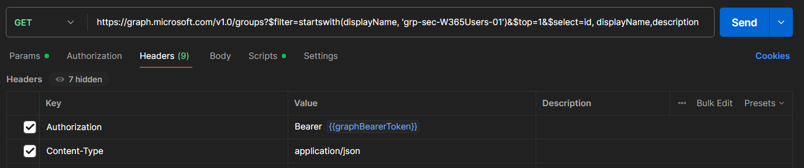

# Postman #

To understand each Graph API call, I love to use Postman to not just test the correctness of the API call, both also have an easy way to play around with filters and other call details
  
This exercise let's you play around with the API calls in Postman and shares some additional Postman 'secrets', like using Post-Request scripts to store response output into variables that can easily be used in subsequential calls.
  
<u>Exercise:</u> Sign up for a free <a href='https://www.postman.com/' target='_new'>Postman</a> account   
<u>Exercise:</u> Sign in to use the <a href='https://www.postman.com/' target='_new'>Postman</a> web console   

## Postman environments ##
<u>Exercise:</u> Select the Environments tab and click on [Import] to open the ExpertsLiveNL_GraphAPI_Workshop.postman_environment.json and preload the required credentials for the Graph API calls   
The JSON file with the Collection of Graph API calls can be found here: <a href='https://github.com/cloud-devops-ninja/myWorkshops/blob/main/GraphAPI_StarterKit/Exercises/Exercise02/ExpertsLiveNL_GraphAPI_Workshop.postman_environment.json' target="_blank">ExpertsLiveNL_GraphAPI_Workshop.postman_environment.json</a>  
<i>Note: Make sure the environment is actively selected (top right dropbox should show your environment name and not the text 'No environment')</i>  

## Postman workspace ##
<u>Exercise:</u> Select the Collections tab and click on [+] to create your first (blank) collection   
    <ul>
    <li><a href='https://learn.microsoft.com/en-us/graph/auth-v2-user?view=graph-rest-1.0&tabs=http#step-2-request-an-access-token' target='_blank'>Graph Authentication:</a></li>
    
Note: Keep in mind that this is a special Graph API call to authenticate and retrieve a bearer token for future calls.

    <b>HTTP Method:</b> POST 
    <b>URI:</b> https://graph.microsoft.com/v1.0/deviceManagement/virtualEndpoint/provisioningPolicies 
    <b>REQUEST BODY:</b> 
    <code>{
    "grant_type": "client_credentials",
    "client_id": "{{clientId}}",
    "client_secret": "{{clientSecret}}",
    "scope": "https://graph.microsoft.com/.default"
}</code> 
    <b>REQUEST HEADER:</b> 
    <code>{
    "Content-Type": "application/x-www-form-urlencoded"
}</code>
</ul>
   

   
Postman supports the usage of Post-response scripts that allow you to store response output into an environment variable, which can be used in other calls (so no copy-paste required).  
Here is the code for the Post-response script to store the access_token into a graphBearerToken variable:
<code class="language-javascript">
// post-request script to store the Graph BearerToken into a global variable
pm.test(pm.info.requestName, () => {
    pm.response.to.not.be.error;
    pm.response.to.not.have.jsonBody('error');
});
pm.globals.set("graphBearerToken", pm.response.json().access_token);

// output to console
console.log('Step 00 - graph BearerToken: '+ pm.response.json().access_token.substring(0,25) + '...');
</code>
   
<ul>
    <li><a href='https://learn.microsoft.com/en-us/graph/api/group-get?view=graph-rest-1.0&tabs=http' target='_blank'>Get Group ID from Entra:</a></li>
    <b>HTTP Method:</b> GET 
    <b>URI:</b> https://graph.microsoft.com/v1.0/groups?$filter=startswith(displayName, 'grp-sec-W365Users-01')&$top=1&$select=id, displayName,description 
    <b>REQUEST BODY:</b><code>no request body</code> 
    <b>REQUEST HEADER:</b> 
    <code>{
    "Authorization": "Bearer {{graphBearerToken}}",
    "Content-Type": "application/json"
}</code>
</ul>

   
Here is the code for the Post-response script to store the group ID a variable:
<code class="language-javascript">
// post-request script to store the Graph BearerToken into a global variable
pm.test(pm.info.requestName, () => {
    pm.response.to.not.be.error;
    pm.response.to.not.have.jsonBody('error');
});
pm.globals.set("graphBearerToken", pm.response.json().access_token);

// output to console
console.log('Step 00 - graph BearerToken: '+ pm.response.json().access_token.substring(0,25) + '...');
</code>
   

    

        Shortcut: Import workshop collection with all calls
    

    The JSON file with the Collection of Graph API calls can be found here: <a href='https://github.com/cloud-devops-ninja/myWorkshops/blob/main/GraphAPI_StarterKit/Exercises/Exercise02/ExpertsLiveNL_GraphAPI_Workshop.postman_collection.json' target="_blank">ExpertsLiveNL_GraphAPI_Workshop.postman_collection.json</a>  
    For those that do not want to build their own API calls, feel free to import the collection that contains the Graph API calls for this workshop:
    <ul>
    <li>Click [import]</li>
    <li>Select ExpertsLiveNL_GraphAPI_Workshop.postman_collection.json</li>
    <li>Check out the different API calls in the collection</li>
    </ul>

   

