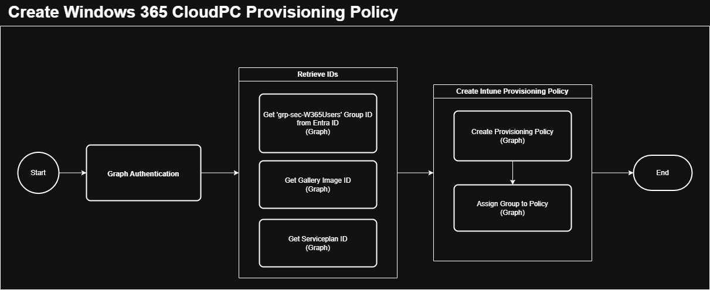
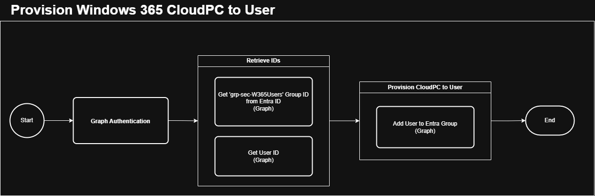

# PowerShell #

After we have a good feel of the Graph API call settings and the expected response, we can translate the Postman API calls to REST API Powershell calls, using the builtin cmdlet <a href='https://learn.microsoft.com/en-us/powershell/module/microsoft.powershell.utility/invoke-restmethod?view=powershell-7.5' target="_blank">Invoke-RestMethod</a>.<br>  
  
This exercise let's you play around with the Invoke-RestMethod by using a basic REST API template for PowerShell
  
<u><b>Exercise:</b></u> Start your favorite PowerShell editor<br>
<u><b>Exercise:</b></u> Build your Graph API Authentication call in PowerShell, using the below template<br>  

```powerShell
# URL for the REST API call
$restUri = "https://login.microsoftonline.com/$tenantId/oauth2/v2.0/token"
# Method for the REST API call
$restMethod = "POST"
# Body for the REST API call
$restBody = @{
    grant_type    = "client_credentials"
    client_id     = $clientId
    client_secret = $clientSecret
    scope         = "https://graph.microsoft.com/.default"
}
# Headers for the REST API call
$restHeaders = @{
    "Content-Type"  = "application/x-www-form-urlencoded"
}
# Make the REST API call to retrieve the token response and store it in a variable
$restResponse = Invoke-RestMethod -Uri $restUri -Method $restMethod -Body $restBody -Headers $restHeaders
```
<br>  

<u><b>Exercise:</b></u> Build your Graph API call to retrieve the Group ID in PowerShell, using the below template<br>  

```powerShell
# URL for the REST API call
$restUri = "https://graph.microsoft.com/v1.0/groups"
$restUri += "?`$filter=startswith(displayName, 'grp-sec-W365Users-01')"   # filter
$restUri += "&`$top=1&`$select=id, displayName,description"      # select
# Method for the REST API call
$restMethod = "GET"
# NO Body for a REST API call with Method GET
# Headers for the REST API call
$restHeaders = @{
    "Authorization" = "Bearer $graphBearerToken"; 
    "Content-Type"  = "application/json"
}
# Make the REST API call to retrieve the token response and store it in a variable
$restResponse = Invoke-RestMethod -Method $restMethod -Uri $restUri -Headers $restHeaders
```
<br>  

<br>  

<i>Note: You can find the PowerShell workflow for creating the Intune Provisioning Policy <a href='https://github.com/cloud-devops-ninja/myWorkshops/blob/main/GraphAPI_StarterKit/Exercises/Exercise03/02_W365_Create_Provisioning_Policy.ps1' target="_blank">here</a></i><br>  
<br>  

<br>  

<i>Note: You can find the PowerShell workflow for adding a user to a Entra Group <a href='https://github.com/cloud-devops-ninja/myWorkshops/blob/main/GraphAPI_StarterKit/Exercises/Exercise03/03_W365_Provision_CloudPC_to_User.ps1' target="_blank">here</a></i><br>  
<br>
  
